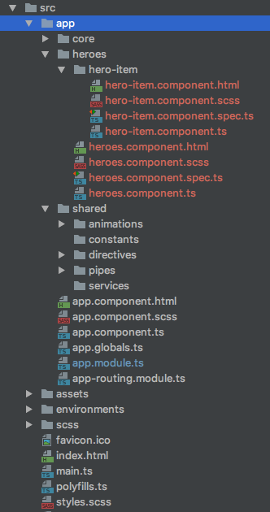
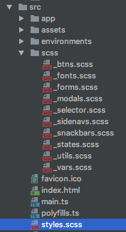

# Angular 5 Principles

## Introduction

[Angular](https://angular.io/) has become one of the most used frameworks to build modern web apps. It solves many problems of enterprise apps, it is very popular, it is backed up by Google and it can have a steep learning curve compared to other frameworks. Other frameworks like [React](https://reactjs.org/) and [Vue.js](https://vuejs.org/) are also used to build web apps but are less opinionated and each of these frameworks come with their [pros and cons](https://www.academind.com/articles/javascript/angular-vs-reactjs-vs-vuejs/). You can compare their current popularity through [Stack Overflow Trends](https://insights.stackoverflow.com/trends?tags=jquery%2Cangularjs%2Cangular%2Creactjs).

This document will provide general recommendations and links for common scenarios encountered when building a complex web application with Angular. Here at [Fresh Consulting](https://www.freshconsulting.com/) we have build many Angular apps successfully and this guide should help address many of those situations. Here are the topics covered:

[Learning Resources](#resources)

[Setup](#setup)

[File Organization](#files)

[Documentation](#docs)

[State Management](#state)

[Forms](#forms)

[CSS and Frameworks](#css)

[Code Style](#code)

[Automation](#automation)

[Updating](#updating)

[Lazy Loading a Module](#lazy)

## <a id="resources"><a/>Learning Resources

Angular 2 was rebranded as [Angular](https://angular.io/) since it is so different from Angular 1 or [AngularJS](https://angularjs.org/). The versions 2 - 5 and beyond should refer to Angular and not AngularJS. You should definitely have a good understanding of Javascript, HTML, CSS. Ideally you also know about NPM, Sass, and terminal (Bash or Powershell). You can start by taking the [Tour of Heroes Tutorial](https://angular.io/tutorial) if you haven’t already done so. There are [plenty of free learning resources](https://github.com/jmcunningham/AngularJS2-Learning) online. Some of our favorite ones are:

* [The official Angular Documentation](https://angular.io/docs)

* [The official Angular Cheatsheet](https://angular.io/guide/cheatsheet)

* [Adventures In Angular](https://devchat.tv/adv-in-angular) (Podcast)

* [NgDocio](http://ngdoc.io/) (unofficial documentation made of curated blogs)

* [Lynda.com Courses](https://www.lynda.com/AngularJS-tutorials/Angular-2-Essential-Training/540347-2.html?srchtrk=index%3a1%0alinktypeid%3a2%0aq%3aangular+2%0apage%3a1%0as%3arelevance%0asa%3atrue%0aproducttypeid%3a2)

* [Udemy Course](https://www.udemy.com/learn-angular-2-from-beginner-to-advanced/)

* [Angular Resources](https://angular.io/resources)

## <a id="setup"><a/> Setup

For the smoothest experience use the official [Angular-CLI](https://cli.angular.io/). To install it from the command line you need to have [Node.js](https://nodejs.org/en/) which comes with [NPM](https://www.npmjs.com/) to manage your libraries/dependencies. It will create a project, scaffold the main files, setup unit and e2e testing and it has a lot of useful utilities that you can see in their [documentation](https://github.com/angular/angular-cli/wiki).

We prefer to setup a project using [Sass](http://sass-lang.com/) instead of CSS since it will improve your styling workflow. Run the command `ng new [my _new_project _name] --style sass` in your prefered folder to start using Sass.

## <a id="files"><a/>File Organization

The CLI already provides a basic structure for your app but you will have to make some decisions about the structure when the app gets more complex. It is recommended that you use the structure suggested in [Stack Overflow](https://stackoverflow.com/questions/35346342/which-type-of-folder-structure-should-be-used-with-angular-2). Here is a summary of it:

1. A source folder will contain `index.html` file, `main.ts` file and the `app` folder which ontains the `core` and `shared` folders.

2. Things that are always visible or used everywhere can go to the `core` folder (a footer component or an exception handler service).

3. Services will go in the related component folder or in `shared/services` if it is shared. Consider adding a `directives`, `animations` and `pipes` folders in shared to reuse those features too.

4. Components that are related with the URL can be nested in the `src` folder. Example URL [www.mywebsite.com/heroes/6545](www.mywebsite.com/hero/6545) can have the folder `heroes` with the `heroes.component.ts` and inside this folder we can have the folder `hero-item` with the component `hero-item.ts` which refers to the individual item. Remember that having too many nested components will come at a price. If you see this, consider flattening your structure.

5. Consider adding an `app.globals.ts` file in the top for global app constants. [Typescript enums](https://github.com/angular/angular-cli/wiki/stories-application-environments) are also very helpful to store shared or component constants. Use the `shared` and component folders for them. This is different than the environment files which should contain settings for the environment.

6. Consider adding all configuration options to the environmental variables. [This link](https://github.com/angular/angular-cli/wiki/stories-application-environments) shows how to add more environmental variables using the CLI.

## <a id="docs"><a/>Documentation

Simple and complex applications require good documentation. Try to use [API Blueprint](https://apiblueprint.org/) or [Swagger](https://swagger.io/) to make sure all the backend endpoints are properly explained and documented. These tools have many other tools available to auto generate documentation, join files, and stylize the documentation output. We have used some of these like [Hercule](https://github.com/jamesramsay/hercule), [Aglio](https://github.com/danielgtaylor/aglio), [NSwag](https://github.com/RSuter/NSwag), and [Apiary](https://apiary.io/).

[Compodoc](https://compodoc.github.io/website/) is a great alternative for Angular documentation that compiles an architecture graph and all [JSDoc](https://compodoc.github.io/website/guides/comments.html) like comments into a beautiful looking documentations website.

Make sure to include good comments in your code whenever there is an edge case or a decision that is not standard and point to the right location or link.

## <a id="state"><a/>State Management

State management might be one of the biggest source of bugs if not handled properly. If you want to delegate this responsibility to a [Redux](https://redux.js.org/) pattern you can use [@ngrx/store](https://github.com/ngrx/store). For our projects we prefered to manage state manually using Angular Services with an [observable based pattern](https://coryrylan.com/blog/angular-observable-data-services). It is also important to differentiate between the many places where state gets stored. You can store state in a URL, local Storage, backend, memory, etc. It is recommended to have a single source of truth and well thought syncing and error handling strategy. [Managing State in Angular Applications](https://blog.nrwl.io/managing-state-in-angular-applications-22b75ef5625f) is a great resource to understand when and where to store state.

## <a id="forms"><a/>Forms

Forms are very common in web applications. Angular provides a library that makes it really easy to validate and store forms. There are 2 approaches when working with Angular forms: Template driven forms and Reactive forms. Template driven forms are easy and similar to AngularJS but we prefer Reactive forms since they are more flexible, they allow rxjs event based transformations like debounceTime and distinctUntilChanged, and they are easy to unit test. Here is a [Fundamentals Tutorial](https://toddmotto.com/angular-2-forms-reactive) on how to use Reactive Forms.

## <a id="css"><a/>CSS and Frameworks

After starting a new project using sass as explained in the setup section, you can add an `scss` folder under the `source` folder. This folder will contain global styling modules and a variables file that you can import to your `styles.scss` master file. Each Angular component will also generate a sass file for component-specific-styles. In this way any code refactoring can be moved to a global style. BEM is a pattern that might be great to use for global styles. Component style classes are handled by Angular so [BEM](http://getbem.com/) is not needed but you might want to consider it for consistency.

We really like to use [Angular Material](https://material.angular.io/) which comes with many common components like modals, sidenavs, tables, buttons. etc. Bootstrap and Foundation can also be used but we recommend choosing Angular specific libraries like [Prime Faces](https://www.primefaces.org/primeng/) from the UI Components in [Angular Resources](https://angular.io/resources).

Layout is a very important aspect in the UI of our app and we chose [Angular Flex-Layout](https://github.com/angular/flex-layout) for that job. This frameworks moves all the layout related properties to a template so we can stop thinking about layout in the css realm.

## <a id="code"><a/>Code Style

It is recommended to follow Javascript best practices and follow the [Angular Style Guide](https://angular.io/guide/styleguide). It contains the reasoning behind each Rule which each great for a better understanding of Angular. The CLI comes with [TSLint](https://palantir.github.io/tslint/) which checks code guidelines when running ng lint. It is a good idea to install a visual linter on you IDE to visualize any error. Make sure you use the [.editorconfig](http://editorconfig.org/) file which ensures that every developer editing the codebase will use the same indentation, charset and line length rules.

Here is a summary of the naming section in the Angular Style Guide.

### Apply the single responsibility principle (SRP)

#### Rule of One

- [x] One thing per file (a service/component should focus on one thing only)
- [x] 400 lines max per file

#### Small Functions

- [x] 75 lines max per function

### Naming

#### General

- [x] feature.type.ts

#### Separate file names with dots and dashes

- [x] App-routing.module.ts, drag.service.ts, filter.pipe.ts, hover.directive.ts
- [x] Abbreviations like car.serv.ts are confusing

#### File names representation

- [x] Classes:  class AppRoutingModule {} , class LoggingService {}, class InitCapsPipe {}
- [x] Files: app-routing.module.ts, logging.service.ts, init-caps.pipe.ts

#### Custom prefix for components and directives

- [x] Use app-users instead of users
- [x] Use [appAnimateHeight] (lower camel case)

## <a id="automation"><a/>Automation

Consider automating some steps in the process of creating Pull Request. If you are using Bitbucket, use pipelines to automate Linting, Unit Testing and E2E testing. You can also use pipelines to push your latest documentation and the build of your code automatically to a dedicated server. You can read more about it in [this blog](https://www.freshconsulting.com/you-should-be-using-bitbucket-pipelines/).

## <a id="updating"><a/>Updating

Angular might update frequently so consider updating your app as soon as a new version comes out. You will have more control over new features than updating later when a lot of functionality that is deprecated can break your app.

## <a id="lazy"><a/>Lazy Loading a Module

Modules can be loaded based on the change of route in order to reduce startup time. This might not be necessary in enterprise apps but would be very useful for any public facing app. You can read more about it in this [Ragle.io Tutorial](https://angular-2-training-book.rangle.io/handout/modules/lazy-loading-module.html)
